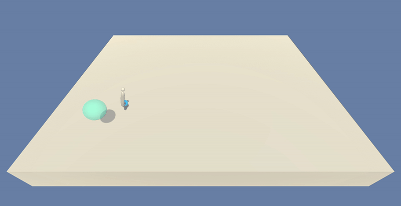
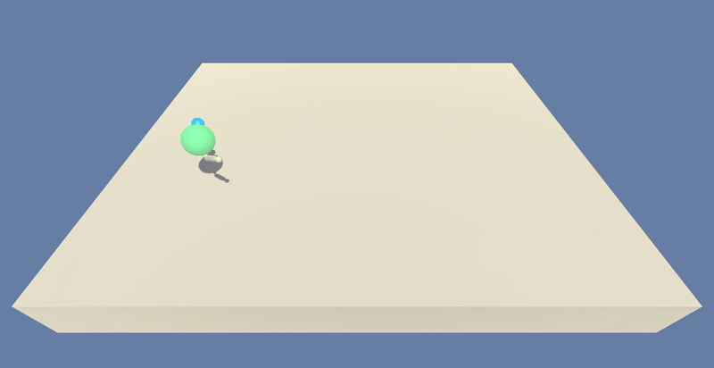

# Continuous_Control_using_DDPG

### Introduction

For this project, we will work with the [Reacher](https://github.com/Unity-Technologies/ml-agents/blob/master/docs/Learning-Environment-Examples.md#reacher) environment. We will try to solve it using `Deep Deterministic Policy Gradient (DDPG) Algorithm`. 


In this environment, a double-jointed arm can move to target locations. A reward of +0.1 is provided for each step that the agent's hand is in the goal location. Thus, the goal of our agent is to maintain its position at the target location for as many time steps as possible.

The observation space consists of 33 variables corresponding to position, rotation, velocity, and angular velocities of the arm. Each action is a vector with four numbers, corresponding to torque applicable to two joints. Every entry in the action vector should be a number between -1 and 1. This is an example of continuous action space. 

### Distributed Training

For this project, we can work with two separate versions of the Unity environment:
- The first version contains a single agent.
- The second version contains 20 identical agents, each with its own copy of the environment.

### Solving the Environment

#### Solving the First Version

The task is episodic, and in order to solve the environment,  our agent must get an average score of +30 over 100 consecutive episodes.

#### Solving the Second Version

The barrier for solving the second version of the environment is slightly different, to take into account the presence of many agents.  In particular, our agents must get an average score of +30 (over 100 consecutive episodes, and over all agents).  Specifically,
- After each episode, we add up the rewards that each agent received (without discounting), to get a score for each agent.  This yields 20 (potentially different) scores.  We then take the average of these 20 scores. 
- This yields an **average score** for each episode (where the average is over all 20 agents).

The environment is considered solved, when the average (over 100 episodes) of those average scores is at least +30.

### Dependencies

To set up your python environment to run the code in this repository, follow the instructions below. Please note that we will be using `Anaconda`
for executing the code. 

1. Download the environment from one of the links below.  You need only select the environment that matches your operating system:

    - **_Version 1: One (1) Agent_**
        - Linux: [click here](https://s3-us-west-1.amazonaws.com/udacity-drlnd/P2/Reacher/one_agent/Reacher_Linux.zip)
        - Mac OSX: [click here](https://s3-us-west-1.amazonaws.com/udacity-drlnd/P2/Reacher/one_agent/Reacher.app.zip)
        - Windows (32-bit): [click here](https://s3-us-west-1.amazonaws.com/udacity-drlnd/P2/Reacher/one_agent/Reacher_Windows_x86.zip)
        - Windows (64-bit): [click here](https://s3-us-west-1.amazonaws.com/udacity-drlnd/P2/Reacher/one_agent/Reacher_Windows_x86_64.zip)

    - **_Version 2: Twenty (20) Agents_**
        - Linux: [click here](https://s3-us-west-1.amazonaws.com/udacity-drlnd/P2/Reacher/Reacher_Linux.zip)
        - Mac OSX: [click here](https://s3-us-west-1.amazonaws.com/udacity-drlnd/P2/Reacher/Reacher.app.zip)
        - Windows (32-bit): [click here](https://s3-us-west-1.amazonaws.com/udacity-drlnd/P2/Reacher/Reacher_Windows_x86.zip)
        - Windows (64-bit): [click here](https://s3-us-west-1.amazonaws.com/udacity-drlnd/P2/Reacher/Reacher_Windows_x86_64.zip)

2. Enter Anaconda terminal and create (and activate) a new environment with Python 3.6.

	- __Linux__ or __Mac__: 
	```bash
	conda create --name drlnd python=3.6
	source activate drlnd
	```
	- __Windows__: 
	```bash
	conda create --name drlnd python=3.6 
	conda activate drlnd
	```
	  
3. Perform a minimal install of OpenAI gym.
  ```bash
  pip install gym
  ```

4. Clone this repository, and navigate to the `python/` folder.  Then, install several dependencies.
  ```bash
  cd Continuous_Control_using_DDPG/python
  pip install .
  ```
5. Download whl file for `torch 0.4.0` from `http://download.pytorch.org/whl/cpu/torch-0.4.0-cp36-cp36m-win_amd64.whl`. Then install it using the command below. Also install `pywinpty` using `pipwin`, then install `jupyter` [Note: during installation of `jupyter` it tries to install a higher version of `pywinpty` and can give some error which we can ignore.]
  ```bash
  pip install --no-deps path_to_torch_whl_file\torch-0.4.0-cp36-cp36m-win_amd64.whl
  pip install pipwin
  pipwin install pywinpty
  pip install jupyter
  ```
6. Create an IPython kernel for the drlnd environment. We can use this kernel if we use `jupyter notebook` to run. Before running code in a notebook, change the kernel to match the `drlnd` environment by using the drop-down `Kernel` menu.
  ```bash
  python -m ipykernel install --user --name drlnd --display-name "drlnd"
  ```

7. Extract the previously downloaded zip file for Environment [in step 1], to the root folder i.e. `Continuous_Control_using_DDPG/`.

8. We need to run `main.py` for both training and testing. Follow the below instruction for training. We can set the total number of episodes, iterations per episode, number of agents, starting value of epsilon, minimum value of epsilon and epsilon decay [for off-policy epsilon-greedy algorithm] during the training through command line. 
  ```bash
  python main.py --n_episodes 2000 --max_t 1000 --num_agents 20 --eps_start 1 --eps_end 0.01 --eps_decay 0.995
  ```

9. Similarly follow the below instruction for testing. We need to provide a checkpoint file of actor and critic network for this. **NOTE:** We can even use the agent trained on the 20 agent environment as a checkpoint for the single agent environment. 
  ```bash
  python main.py --evaluate_actor best_checkpoints/checkpoint_actor_cc.pth --evaluate_critic best_checkpoints/checkpoint_critic_cc.pth --num_agents 20
  ```

10. To get better understanding on the available parameters to be passed in command line, use the help function as below, 
  ```bash
  python main.py -h
  ```

11. The model parameters get stored in the folder `Continuous_Control_using_DDPG/checkpoints/`. The checkpoints get stored for any network scoring above 30. Our best trained checkpoints are kept in the folder `Continuous_Control_using_DDPG/best_checkpoints/`. The plots for the training get stored in `Continuous_Control_using_DDPG/plots/`.

12. The Jupyter notebook solution `Continuous_Control.ipynb` and the project report `Report.ipynb` are present in the folder `Continuous_Control_using_DDPG/report/`.

13. Below is how the agents were acting without training [for both single agent and 20 agents]. The agents take random actions. 

 

14. After training, it looks as below. The agents successfully learn to track the goal locations. 

 

### References

References for the DDPG code was taken from the solutions of Udacity's [BipedalWalker environment](https://github.com/udacity/deep-reinforcement-learning/tree/master/ddpg-bipedal) and [Pendulum environment](https://github.com/udacity/deep-reinforcement-learning/tree/master/ddpg-pendulum).
